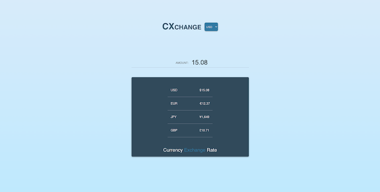

<h1 align="center">CXchange</h1>

A currency exchange calculator app with React Hooks 🤑  💰


<br />

<h3>Install</h3>

```js
- Clone repository
- Install dependencies
```


<h3>Run</h3>

```js
- Type `npm start`
```

<br />

<h2>Branches &nbsp; :octocat:</h2>

<p> • <b>WithRedux</b>: &nbsp; Applying Redux to React Hooks Main branch  </p>


<h3>Screenshot</h3>

Simple currency exchange calculator with Hooks.




